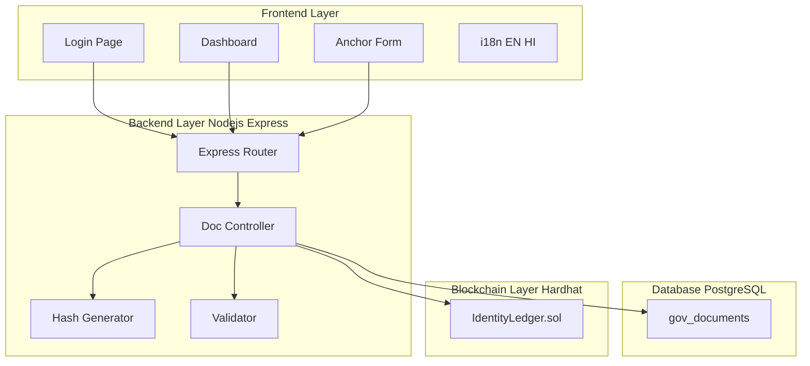

<div align="center">

# TrustID
### Government Identity Verification System


A secure web application for anchoring and verifying government identity documents (Aadhaar, PAN, Voter ID) using SHA-256 hashing, a PostgreSQL database, and a local Ethereum blockchain (Hardhat) for immutable on-chain verification.

</div>

---

## System Architecture



**End-to-end flow:** User submits an identity document → Backend validates input → SHA-256 hash is computed → Record is saved to PostgreSQL → Hash is anchored on the Ethereum blockchain → Both layers can independently verify or revoke the document.

---

## Tech Stack

| Layer | Technology | Purpose |
|---|---|---|
| Frontend | HTML / CSS / Vanilla JS | Portal UI, bilingual (EN/HI) |
| Backend | Node.js + Express | REST API, business logic |
| Database | PostgreSQL | Persistent storage of hashes & metadata |
| Blockchain | Hardhat + Solidity | Immutable on-chain document registry |
| Hashing | SHA-256 (Node.js crypto) | Tamper-proof document fingerprinting |
| Blockchain client | ethers.js v6 | Backend ↔ smart contract communication |

---

## Prerequisites

Make sure the following are installed before proceeding:

| Tool | Version | Purpose |
|---|---|---|
| [Node.js](https://nodejs.org/) | v18+ | Backend runtime & tooling |
| [PostgreSQL](https://www.postgresql.org/) | v12+ | Local database for hashes & metadata |
| [Hardhat](https://hardhat.org/) | Latest | Local Ethereum blockchain simulation |
| Git | Any | Cloning the repository |

Install Hardhat globally:
```bash
npm install -g hardhat
```

---

## Project Setup

Run these steps **once** after cloning the repository.

### 1. Install Dependencies

Install backend dependencies from the project root:
```bash
npm install
```

Then install blockchain dependencies:
```bash
cd blockchain
npm install
cd ..
```

### 2. Set Up the Database

1. Open PostgreSQL (`psql` or pgAdmin) and create a database:
   ```sql
   CREATE DATABASE identity_db;
   ```
2. Run the migration script to create the required tables:
   ```bash
   node backend/scripts/migrate.js
   ```

### 3. Configure Environment Variables

Create a `.env` file inside the `backend/` directory:

```env
# Server
PORT=3000

# PostgreSQL
DB_HOST=localhost
DB_PORT=5432
DB_NAME=identity_db
DB_USER=postgres
DB_PASSWORD=your_postgresql_password

# Blockchain
BLOCKCHAIN_RPC_URL=http://127.0.0.1:8545
```

> Make sure `DB_PASSWORD` matches your local PostgreSQL setup.

---

## Running the Project

This project requires **three terminal windows** running simultaneously.

### Terminal 1 — Start the Local Blockchain

```bash
cd blockchain
npx hardhat node
```
> Keep this running. It simulates a local Ethereum network.

### Terminal 2 — Deploy the Smart Contract

```bash
cd blockchain
npx hardhat run scripts/deploy.js --network localhost
```
> This deploys the identity verification contract and saves its address to the backend config.

### Terminal 3 — Start the Backend Server

From the project root:
```bash
npm run start
```

### Access the App

Once the server logs `🚀 Server is running on http://localhost:3000`, open your browser and navigate to:

```
http://localhost:3000
```

**Test credentials:**
- Phone: `9876543210`
- OTP: `123456`

Enter any identity data and click **"Secure Details on Ledger"** to anchor it on the blockchain.

> ⚠️ **Important:** Every time you restart the Hardhat node (Terminal 1), the blockchain resets. You must re-run the deploy step (Terminal 2) and restart the backend (Terminal 3) to reconnect.

---

## API Reference

| Method | Endpoint | Description |
|---|---|---|
| `POST` | `/api/documents` | Anchor a new identity document |
| `GET` | `/api/documents` | Fetch all anchored documents |
| `POST` | `/api/documents/verify` | Verify an identity (hash comparison) |
| `GET` | `/api/documents/stats` | Aggregate stats by document type |
| `GET` | `/api/documents/:identity_no` | Fetch a single record by ID number |
| `GET` | `/api/documents/:identity_no/blockchain-verify` | Cross-check DB hash vs on-chain record |
| `PUT` | `/api/documents/:identity_no` | Update document details |
| `DELETE` | `/api/documents/:identity_no` | Remove from DB and revoke on-chain |

---

## Smart Contract

The `IdentityLedger` contract (Solidity `^0.8.20`) is deployed on a local Hardhat network and exposes:

| Function | Access | Description |
|---|---|---|
| `anchorDocument(hash, docType, identityRef)` | Owner only | Stores a document hash on-chain |
| `verifyDocument(hash)` | Public | Returns full record details |
| `revokeDocument(hash)` | Owner only | Marks a document as revoked |
| `isHashAnchored(hash)` | Public | Quick existence check |
| `isHashValid(hash)` | Public | Checks existence and non-revocation |
| `getTotalAnchored()` | Public | Returns total anchored count |

---

## Validation Rules

| Document | Format | Example |
|---|---|---|
| Aadhaar | Exactly 12 digits | `1234 5678 9012` |
| PAN | 5 letters + 4 digits + 1 letter | `ABCDE1234F` |
| Voter ID (EPIC) | 8–12 alphanumeric characters | `ABC1234567` |

---

## Inspecting the Database

When a document is submitted, its SHA-256 hash and metadata are stored in PostgreSQL before being anchored on-chain. You can inspect this data two ways:

**pgAdmin (GUI)**
1. Connect to your local PostgreSQL server.
2. Navigate to: `Servers → your server → Databases → identity_db → Schemas → Tables`
3. Right-click `gov_documents` → **View/Edit Data → All Rows**

**psql (CLI)**
```bash
psql -U postgres -d identity_db
```
```sql
SELECT id, doc_type, name, identity_no, hash FROM gov_documents;
```
Type `\q` to exit.

---

## Project Structure

```
TrustID/
├── frontend/
│   ├── index.html          # Main dashboard
│   ├── login.html          # Login page
│   ├── script.js           # Frontend logic
│   ├── styles.css          # UI styles (dark mode ready)
│   └── translations.js     # EN / HI i18n strings
├── backend/
│   ├── server.js           # Entry point
│   ├── src/
│   │   ├── app.js          # Express setup
│   │   ├── config/
│   │   │   ├── blockchain.js   # ethers.js + contract init
│   │   │   └── database.js     # PostgreSQL pool
│   │   ├── controllers/
│   │   │   └── documentController.js
│   │   ├── middleware/
│   │   │   └── errorHandler.js
│   │   ├── routes/
│   │   │   └── documentRoutes.js
│   │   └── utils/
│   │       ├── hashGenerator.js
│   │       └── validator.js
│   ├── database/
│   │   └── schema.sql
│   └── scripts/
│       ├── migrate.js
│       └── importCSV.js
└── blockchain/
    ├── contracts/
    │   └── IdentityLedger.sol
    ├── scripts/
    │   ├── deploy.js
    │   └── interact.js
    ├── test/
    │   └── IdentityLedger.test.js
    └── hardhat.config.js
```
